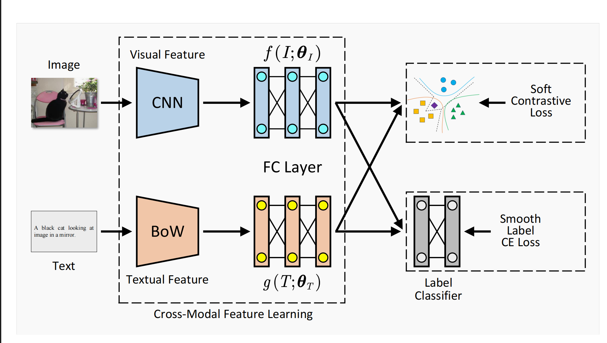

# Soft Contrastive Cross-Modal Retrieval

## Abstract
Cross-modal retrieval plays a key role in neural language processing area, which aims to retrieve one modality to another efficiently. Although most existing cross-modal retrieval methods have achieved remarkable performance, the embedding boundary becomes sharp and tortuous with the upgrade of model complexity. Besides, most of exist methods realize the outstanding results on the basis of datasets without any error or noise, but that is extremely ideal and leads to trained model lack of robustness. To solve these problems, in this paper we propsed a novel approach, Soft Contrastive Cross-Modal Retrieval(SCCMR), which integrate deep cross-modal model with soft contrastive learning and smooth label cross-entropy learning to boost common subspace embedding and improve the generalizability and robustness of model. To confirm the performance and effectiveness of SCCMR, we conduct extenstive experiments comparing with 12 state-of-the-arts on two multimodal datasets by using the image-text retrieval as a showcase. The experimental results show that our proposed method outperforms the baselines.
  
## Framework



## Quickstart
```
python main.py
```